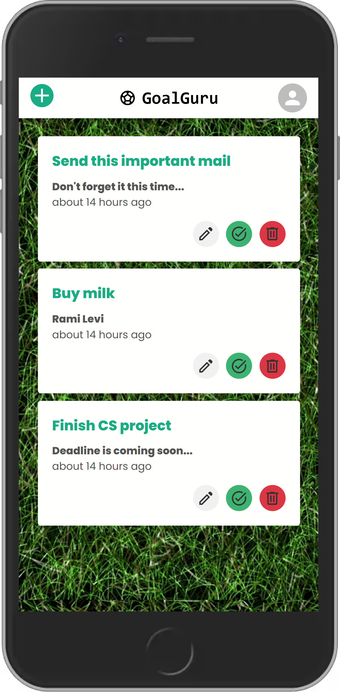

# GoalGuru-frontend

## A MERN to-do list app

In this project, I explored various full-stack processes and technologies in order to create a responsive MERN todo list app.

[Click here to see the result.](https://goalguru.onrender.com/)

Tools I used: React, React Context, SASS, MUI, Node.js, Express, MongoDB, Mongoose, bcrypt, jsonwebtoken and Vite.

Here are some photos of the final product:

   
   

    

## What I Learned from this Project?

One of the key takeaways from this project was the power and versatility of React. By utilizing React, I was able to build a dynamic and responsive user interface, allowing for a smooth and enjoyable user experience. React Context proved to be a valuable tool for managing global state, simplifying the process of passing data between components.

MUI (Material-UI) was an excellent addition to the project, offering a comprehensive set of pre-built components and themes. It accelerated the development process by providing ready-made UI elements with consistent design principles, saving both time and effort.

On the server-side, Node.js and Express formed a robust foundation for building a scalable and efficient backend. These technologies enabled me to handle API requests and integrate with the database seamlessly.

MongoDB and Mongoose were the perfect combination for handling data storage. MongoDB's flexibility as a NoSQL database allowed me to easily adapt to changing requirements, while Mongoose provided a convenient way to interact with the database using JavaScript objects and models.

To ensure secure user authentication, I implemented bcrypt for hashing passwords and jsonwebtoken for generating and verifying JSON Web Tokens (JWTs). These libraries played a crucial role in safeguarding user data and protecting sensitive information.

Overall, this project provided me with valuable insights into the power of the technologies and tools I utilized. From front-end development with React to server-side implementation with Node.js, Express, and MongoDB, each component played a vital role in creating a successful full-stack application. I am grateful for the opportunity to work with these technologies and look forward to applying the knowledge gained to future projects.
